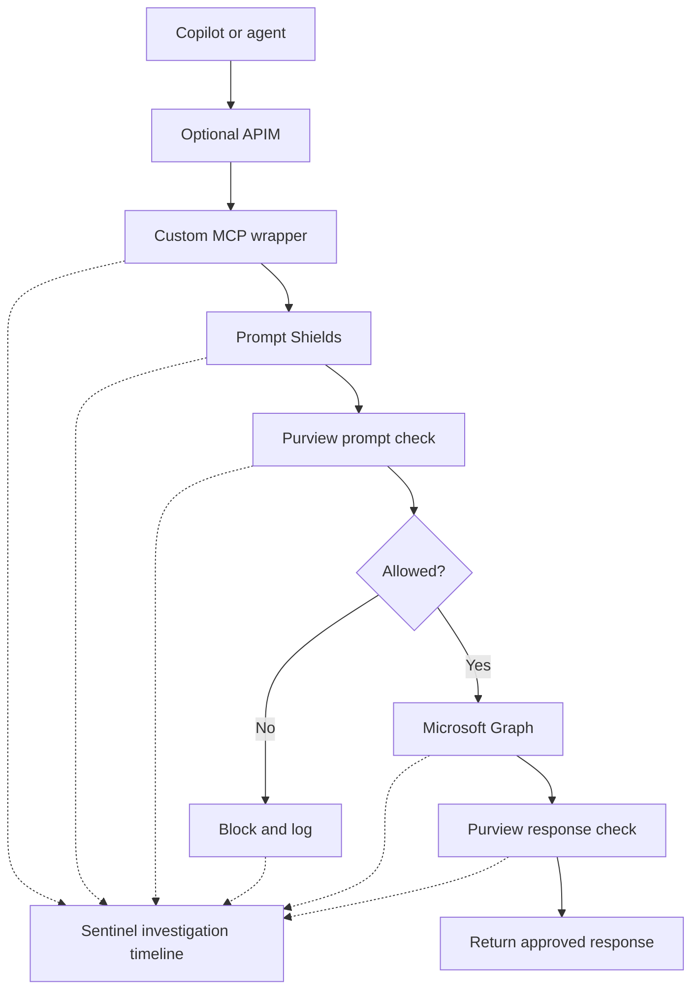

# Custom MCP Server

This directory contains five TypeScript source files showing a custom,
allow-listed MCP tool catalog with security checks before Microsoft Graph.

## Code

- `mcp-server.ts` registers the tools Copilot can discover.
- `tool-handlers.ts` runs Prompt Shields, Purview, Graph, and response checks.
- `prompt-shields.ts` calls Azure AI Content Safety Prompt Shields.
- `service-contracts.ts` defines the Graph, Purview, and security interfaces.
- `request-context.ts` carries authentication and correlation data.

The processing order is:

```text
Prompt Shields -> Purview prompt check -> Graph -> Purview response check
```

If Prompt Shields or Purview blocks the prompt, Graph is not called. If
Purview blocks the response, Graph data is not returned to Copilot.



## Purpose of this test

Cowork or another agent may call Microsoft Graph directly instead of going
through the native Copilot pipeline. In that case, we cannot assume the
Copilot-specific prompt inspection, response inspection, or interaction logs
will be available.

This custom MCP server provides a controlled route for those calls. It checks
the prompt for jailbreak or prompt-injection attacks, submits it to Purview,
allows only the Graph tools and permissions defined in code, checks the Graph
result before returning it, and records the full correlation trail.

This does not replace Entra, Graph, Exchange, or other Microsoft 365 controls.
It adds the application-level inspection and logging that may be missing when
an agent calls Graph outside the native Copilot pipeline.

## Authentication

The user signs in through Microsoft Entra ID and the client sends the token to
the custom MCP service through the selected protected ingress.

The wrapper uses the user's token and its own application identity to request a
Microsoft Graph token on behalf of that user. Graph only allows actions that
both the user and the custom application are permitted to perform.

The `acquireGraphToken` method represents this exchange. The actual tenant,
application ID, credential, and tokens come from protected runtime
configuration and are not stored in this repository.

APIM is not required to run the custom MCP server. In the tested design, APIM
provided centralized token validation, rate limiting, correlation IDs,
routing, and approved request and response telemetry. Another protected ingress
could be used if it provides the required authentication and security controls.

## Build steps

To build this example into a running MCP container:

1. Add the Node.js package file with the MCP SDK, Zod, TypeScript, and
   Microsoft identity dependencies.
2. Add the TypeScript build configuration.
3. Add the HTTP entry point that exposes `/health` and `/mcp`.
4. Connect `GovernedM365Service` to the existing OBO, Graph, and Purview code.
5. Supply runtime settings from protected environment variables or a secret
   store.
6. Build and start the image using the Dockerfile and Compose examples below.

Typical runtime settings:

```text
AZURE_TENANT_ID
AZURE_CLIENT_ID
AZURE_CLIENT_SECRET
APPLICATIONINSIGHTS_CONNECTION_STRING
CONTENT_SAFETY_ENDPOINT
CONTENT_SAFETY_API_KEY
```

## Sample Dockerfile

```dockerfile
FROM node:24-alpine AS build
WORKDIR /app
COPY package.json package-lock.json ./
RUN npm ci
COPY tsconfig.json ./
COPY ./*.ts ./
RUN npm run build

FROM node:24-alpine
ENV NODE_ENV=production
WORKDIR /app
COPY package.json package-lock.json ./
RUN npm ci --omit=dev
COPY --from=build /app/dist ./dist
USER node
EXPOSE 3000
CMD ["node", "dist/index.js"]
```

The build stage copies the TypeScript source into the image and compiles it.
The final image contains only production dependencies and compiled JavaScript.

## Sample Docker Compose

```yaml
services:
  custom-mcp:
    build: .
    image: custom-mcp:local
    ports:
      - "127.0.0.1:3000:3000"
    environment:
      AZURE_TENANT_ID: "${AZURE_TENANT_ID}"
      AZURE_CLIENT_ID: "${AZURE_CLIENT_ID}"
      AZURE_CLIENT_SECRET: "${AZURE_CLIENT_SECRET}"
      APPLICATIONINSIGHTS_CONNECTION_STRING: "${APPLICATIONINSIGHTS_CONNECTION_STRING}"
      CONTENT_SAFETY_ENDPOINT: "${CONTENT_SAFETY_ENDPOINT}"
      CONTENT_SAFETY_API_KEY: "${CONTENT_SAFETY_API_KEY}"
    restart: unless-stopped
```

Store the values in a protected environment file or secret store, then build
and start the container:

```bash
docker compose --env-file .env up -d --build
curl http://127.0.0.1:3000/health
```

APIM may be placed in front of the container when centralized gateway controls
and telemetry are wanted, but it is not required by the MCP server.
